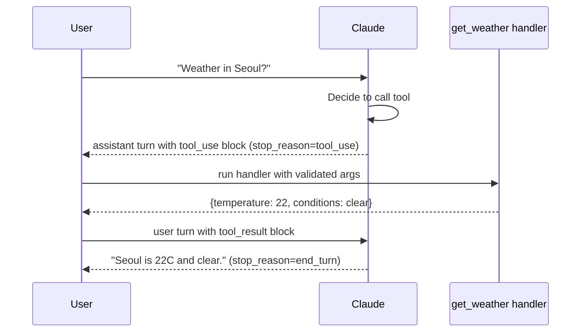

# Recipe 01: Single-turn tool use

## Problem

A user asks a weather question. You want Claude to look up the current
conditions rather than hallucinate them. This is the canonical starting point
for any agent: one user turn, one tool call, one grounded answer.

## Claude features used

- **Tool use** via the `tools` and `tool_choice` parameters on
  `messages.create`.
- **Stop reason inspection** — Claude emits `stop_reason: "tool_use"` when it
  wants you to execute a tool.
- **Structured tool results** including the `is_error` flag for self-correction.

## Pattern



The recipe wraps this loop in a single `run()` function so it can be reused
from tests and from the CLI.

## Implementation

- `recipe.py`:
  - `GetWeatherArgs` — Pydantic v2 model with field descriptions that become
    the JSON schema shown to Claude.
  - `get_weather` — deterministic handler backed by an in-memory fixture;
    production callers swap in an HTTP client.
  - `_extract_tool_use_blocks` — defensive helper that duck-types both SDK
    objects and dict fixtures so the tool loop is trivially testable.
  - `run` — the end-to-end loop returning a structured result that the eval
    framework can consume directly.

## Running it

```bash
cp .env.example .env  # add ANTHROPIC_API_KEY
python recipes/01-tool-use/recipe.py --prompt "What's the weather in Seoul?"
```

## Expected output

```json
{
  "prompt": "What's the weather in Seoul right now?",
  "tool_calls": [
    {"tool": "get_weather", "input": {"city": "Seoul", "unit": "celsius"}, "is_error": false}
  ],
  "final_text": "Seoul is currently 22C with clear conditions.",
  "stop_reason": "end_turn"
}
```

Full payload in [`expected_output.json`](expected_output.json).

## Testing

`test_recipe.py` covers:

1. Handler correctness (including unit conversion and the unknown-city path).
2. A happy-path `tool_use` loop where Claude calls the tool and then
   summarizes.
3. The error path where the tool raises — asserts that the error flows back
   into Claude as a `tool_result` with `is_error=true`.
4. The no-tools path where Claude answers directly without calling a tool.

Every test constructs a `MagicMock` in place of the Anthropic SDK, so `pytest`
passes offline and in CI.

## When to use this

- Use when the user's question maps cleanly to a single retrieval or action.
- Avoid when the task needs multiple dependent lookups — see recipe 02 for
  multi-turn chains.
- Avoid when the "tool" is really a search over your corpus — see recipe 03
  for RAG.

## Extending

- Swap the fixture for a real weather provider. Keep the handler pure
  (Pydantic-in, dict-out) so unit tests stay fast.
- Add rate limiting at the `CookbookClient` layer by subclassing.
- Add an observability hook — `UsageLedger.entries` is a ready source of
  per-call metrics.

## References

- [Anthropic: Tool use overview](https://docs.anthropic.com/en/docs/build-with-claude/tool-use)
- [Anthropic: Tool use best practices](https://docs.anthropic.com/en/docs/build-with-claude/tool-use/overview)
