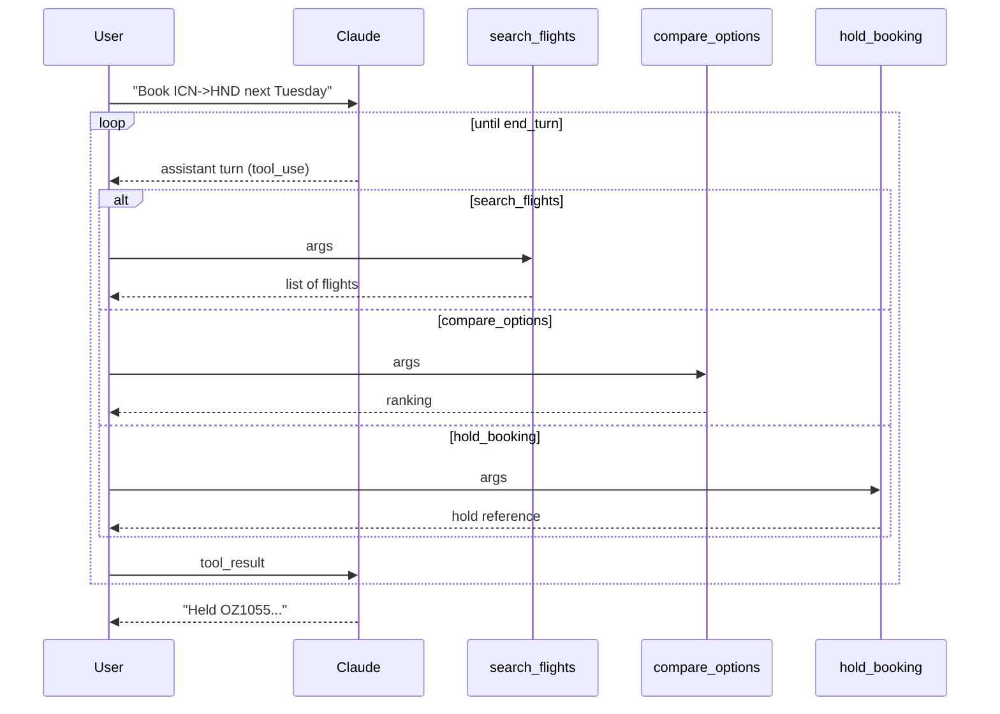

# Recipe 02: Multi-turn tool use with convergence detection

## Problem

A user wants to book a flight. Unlike a simple weather lookup, this requires
a chain: search, compare, hold. Each step depends on the previous output.
The agent must call multiple tools in sequence, observe when the sequence is
complete, and halt cleanly. It must also tolerate bad tool outputs and
refuse to loop forever.

## Claude features used

- **Multi-turn tool use** with `tools` and `tool_choice`.
- **Stop reason loop** — we drive the conversation until `stop_reason !=
  "tool_use"`.
- **Structured tool errors** fed back with `is_error=true` for self-correction.

## Pattern



## Implementation

- `SearchFlightsArgs`, `CompareOptionsArgs`, `HoldBookingArgs` — Pydantic v2
  models with field validators (IATA code, ISO date, weight ranges).
- `search_flights`, `compare_options`, `hold_booking` — deterministic
  handlers backed by an in-memory fixture; replace with HTTP integrations.
- `run_agent` — the loop. Emits a `LoopOutcome` containing:
  - `reason`: `"converged"`, `"budget_exhausted"`, or `"error"`
  - `iterations`: number of Claude round-trips
  - `final_text`: the assistant's closing message
  - `tool_trace`: every tool call with input, output, and `is_error` flag.

## Running it

```bash
python recipes/02-multi-turn-tool-use/recipe.py \
    --prompt "Book me a flight from ICN to HND on 2026-04-21. Passenger: Doeon Kim."
```

## Expected output

Abbreviated — full payload in [`expected_output.json`](expected_output.json):

```json
{
  "reason": "converged",
  "iterations": 4,
  "final_text": "Held OZ1055 (Asiana, 140 min, $395) for Doeon Kim...",
  "tool_trace": [
    {"iteration": 1, "tool": "search_flights", "is_error": false},
    {"iteration": 2, "tool": "compare_options", "is_error": false},
    {"iteration": 3, "tool": "hold_booking",   "is_error": false}
  ]
}
```

## Testing

`test_recipe.py` covers:

1. Argument validation for every tool (including the IATA rejection path).
2. Handler correctness for `search_flights`, `compare_options` (weighted
   ordering), and `hold_booking` (determinism).
3. The happy-path multi-turn loop — asserting convergence after three tool
   calls.
4. The pathological loop — Claude keeps calling `search_flights`; the recipe
   must stop at `max_iterations` with `reason="budget_exhausted"`.
5. Tool-error propagation — when a handler raises, the error flows back into
   Claude as a `tool_result(is_error=true)` and the loop continues.

## When to use this

- Use when a task requires multiple dependent steps that can be named and
  scoped.
- Avoid when the task reduces to pure retrieval — use recipe 03 (RAG).
- Avoid when different steps need very different models or personas — use
  recipe 08 (multi-agent).

## Extending

- Swap the fixtures for live integrations. Keep every handler pure so tests
  stay fast.
- Replace the `max_iterations` budget with a cost budget — wire
  `client.ledger.cost_usd` into the stop condition.
- Add a "confirm before hold" step by emitting an assistant turn asking the
  user for approval before invoking `hold_booking`.

## References

- [Anthropic: Multi-step tool use](https://docs.anthropic.com/en/docs/build-with-claude/tool-use)
- [Anthropic: Stop reasons](https://docs.anthropic.com/en/api/messages)
