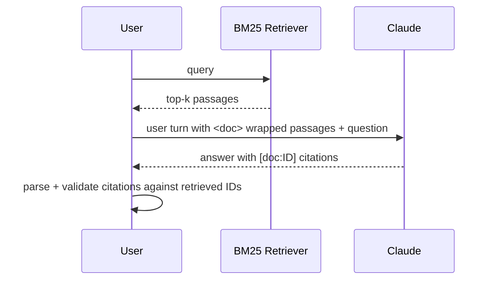

# Recipe 03: Retrieval-augmented generation with citations

## Problem

You want Claude to answer product or policy questions grounded in a private
corpus. Without retrieval Claude may hallucinate. With retrieval, but without
a citation contract, you cannot verify which passages actually supported the
answer. This recipe shows the full pattern: retrieve, inject, constrain the
output to a parseable citation format, and measure citation validity.

## Claude features used

- **Long-context ingestion** — retrieved passages are injected directly into
  the user turn.
- **Structured output contract** — `[doc:ID]` citations constrain Claude's
  output to a form the cookbook can verify programmatically.

## Pattern



## Implementation

- `corpus/` — eight small markdown files drawn from Anthropic's own API
  surface so the recipe is self-consistent.
- `BM25Retriever` — a light wrapper around `rank_bm25`. Swap in an embedding
  retriever (Voyage, OpenAI, local) and nothing else changes.
- `format_context` — wraps each hit in `<doc id title score>` tags.
- `parse_citations` — regex-extracts `[doc:ID]` tokens from the response.
- `answer_query` — drives the pipeline and reports `citation_coverage`, the
  fraction of citations that match a retrieved doc id. Coverage below 1.0
  indicates Claude fabricated a reference.

## Running it

```bash
python recipes/03-rag/recipe.py --query "How does prompt caching affect cost?"
```

## Expected output

```json
{
  "query": "How does prompt caching affect cost?",
  "hits": [{"doc_id": "02_prompt_caching", "score": 4.82}, ...],
  "answer": "Prompt caching charges a 25% premium on first write ... [doc:02_prompt_caching].",
  "citations": ["02_prompt_caching"],
  "citation_coverage": 1.0
}
```

Full payload in [`expected_output.json`](expected_output.json).

## Testing

`test_recipe.py` covers:

1. Corpus loading reads every `corpus/*.md` file.
2. BM25 retrieval returns the prompt-caching doc first for a caching query
   and the streaming doc for a streaming query.
3. `format_context` wraps retrieved passages in `<doc>` tags.
4. `parse_citations` extracts IDs from a response.
5. End-to-end: a mocked Claude response returns a structured result with
   correct `citation_coverage`.
6. Fabrication path: Claude cites a doc id that was not retrieved,
   `citation_coverage` drops to 0.0 — downstream evals can trip on this.

## When to use this

- Use when the answer must be grounded in private or rapidly changing data.
- Use when you can materialize a corpus small enough to index with BM25 or
  large enough to warrant a vector store.
- Avoid when the "source" is one tool call away — use recipes 01/02 instead.

## Extending

- **Embedding retrieval.** Replace `BM25Retriever` with an embedding
  retriever; the rest of the recipe is retriever-agnostic.
- **Hybrid retrieval.** Combine BM25 and embeddings with Reciprocal Rank
  Fusion. Keep the same `[doc:ID]` contract.
- **Multi-hop.** Wrap `answer_query` in recipe 02's tool-use loop so Claude
  can re-query the retriever with a refined question.
- **Faithfulness judging.** Pipe the answer into recipe 10's
  `FaithfulnessRubric` to flag unsupported claims.

## References

- [Anthropic: Long context tips](https://docs.anthropic.com/en/docs/build-with-claude/prompt-engineering/long-context-tips)
- [Anthropic: Contextual retrieval](https://www.anthropic.com/news/contextual-retrieval)
