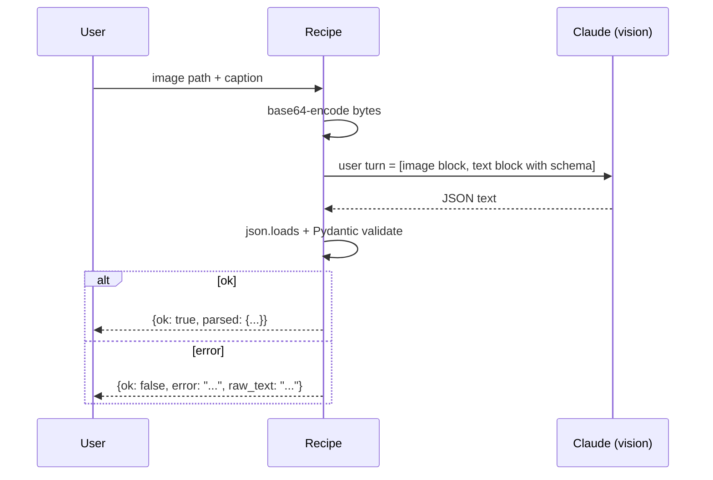

# Recipe 04: Vision for structured document extraction

## Problem

Accounts-payable teams receive hundreds of invoices per day across dozens of
vendor layouts. You want to extract vendor, invoice number, dates, totals,
and line items into a typed record, with validation errors that are easy to
route to a human queue.

## Claude features used

- **Vision content blocks** (`image` with `source.type = "base64"`).
- **Structured JSON output** constrained by a system-prompt contract.
- **Multi-block user messages** — an image block and a text block in a
  single user turn.

## Pattern



## Implementation

- `InvoiceExtraction` — Pydantic v2 model enforcing types, ranges, and ISO
  4217 currency length.
- `encode_image` — path -> (base64, media_type). Supports PNG, JPEG, GIF,
  WebP.
- `build_image_block` — shapes a ready-to-send Anthropic `image` block.
- `_strip_json_fence` — removes ```` ```json ```` wrappers when Claude
  ignores the "no fences" instruction.
- `extract_invoice` — the end-to-end pipeline that always returns a dict
  with `ok: bool` so callers never need a try/except.

## Running it

```bash
# With the shipped 1x1 placeholder (for smoke testing API plumbing only):
python recipes/04-vision/recipe.py

# With a real invoice image:
python recipes/04-vision/recipe.py --image ~/Downloads/real_invoice.png
```

## Expected output

Abbreviated — see [`expected_output.json`](expected_output.json):

```json
{
  "ok": true,
  "parsed": {
    "vendor_name": "ACME Supply Company",
    "invoice_number": "INV-2026-04217",
    "total_usd": 153.01,
    "line_items": [{"sku": "A-440", ...}]
  }
}
```

## Testing

`test_recipe.py` covers:

1. `build_image_block` shape matches the Anthropic API contract.
2. `encode_image` infers the correct media type for JPEG inputs.
3. `InvoiceExtraction` accepts the canonical sample payload.
4. Happy-path extraction with a mocked Claude response.
5. Fence-tolerance path (Claude emits ```` ```json ... ``` ````).
6. Malformed JSON — returns `{ok: false, error: "json_decode_error: ..."}`.
7. Bad schema — returns `{ok: false, error: "schema_validation_error: ..."}`.

## When to use this

- Use for structured extraction from documents, receipts, forms, photos of
  whiteboards.
- Avoid for vanilla OCR that does not need reasoning — a dedicated OCR
  service is cheaper and more deterministic for that alone.
- Avoid for identifying specific people in images (privacy and policy).

## Extending

- **Multi-page invoices.** Pass multiple image blocks in one user turn.
- **Vendor-conditioned schemas.** Run a light classifier on the first page
  to pick a vendor-specific sub-schema, then swap it into
  `RESPONSE_SCHEMA_DOC` before extraction.
- **Human-in-the-loop.** Route `{ok: false}` results to a queue; route
  `{ok: true}` results with suspicious totals (line-items sum != declared
  total) to a secondary check.

## References

- [Anthropic: Vision](https://docs.anthropic.com/en/docs/build-with-claude/vision)
- [Anthropic: JSON mode best practices](https://docs.anthropic.com/en/docs/test-and-evaluate/strengthen-guardrails/increase-consistency)
