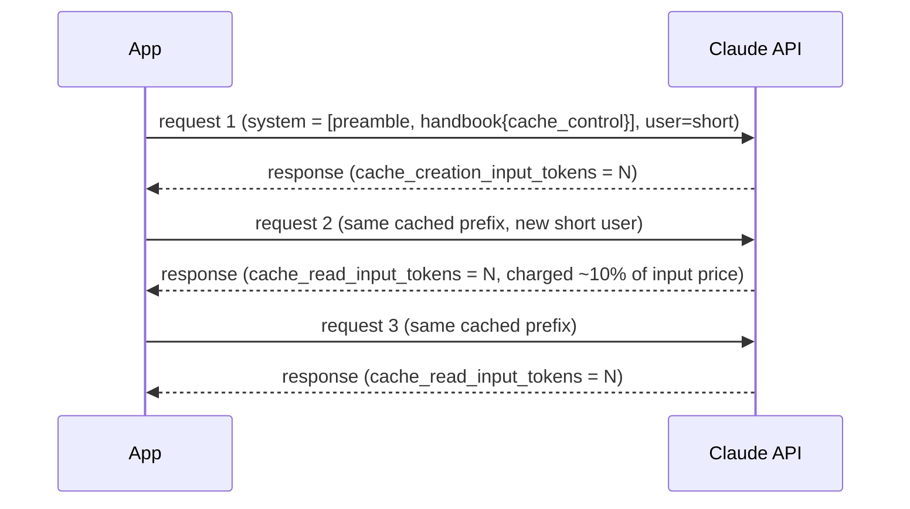

# Recipe 05: Prompt caching for large system prompts

## Problem

Your assistant has a long, stable policy or code-reference prefix — say 3K to
20K tokens — and each user turn is short. You want the per-request cost and
latency to reflect the small user input, not the huge static preamble.

## Claude features used

- **Prompt caching** via `cache_control: {"type": "ephemeral"}` on
  system-prompt blocks.
- **Usage fields** `cache_creation_input_tokens` and
  `cache_read_input_tokens` for empirical measurement.
- **Typed system prompt** — system as a list of blocks rather than a string.

## Pattern



## Implementation

- `build_cacheable_system` — returns a two-block system prompt. The long
  handbook carries `cache_control: {"type": "ephemeral"}`.
- `measure_once` — runs one request and returns a `CacheMeasurement` with
  the relevant usage fields and an itemized cost.
- `compare_runs` — runs three requests with the same cached prefix and
  reports write tokens, total read tokens, and an `estimated_prefix_reuse_pct`.

## Running it

```bash
python recipes/05-prompt-caching/recipe.py
```

## Expected output

```json
{
  "runs": [
    {"input_tokens": 3280, "cache_creation_input_tokens": 3180, "cache_read_input_tokens": 0,    "cost_usd": 0.01286},
    {"input_tokens": 3280, "cache_creation_input_tokens": 0,    "cache_read_input_tokens": 3180, "cost_usd": 0.00183},
    {"input_tokens": 3280, "cache_creation_input_tokens": 0,    "cache_read_input_tokens": 3180, "cost_usd": 0.00180}
  ],
  "summary": {
    "cache_write_tokens": 3180,
    "cache_read_tokens_total": 6360,
    "estimated_prefix_reuse_pct": 100.0,
    "total_cost_usd": 0.01649
  }
}
```

Full payload in [`expected_output.json`](expected_output.json). Without
caching these three requests would cost roughly 3x the first-request price,
or about $0.039. With caching, total cost drops to roughly $0.017.

## Testing

`test_recipe.py` covers:

1. The system prompt has exactly one `cache_control` breakpoint.
2. The breakpoint is placed on the handbook block, not the preamble.
3. `measure_once` reports `cache_creation_input_tokens` on the first call.
4. `compare_runs` aggregates per-request fields into a summary with a
   meaningful `estimated_prefix_reuse_pct`.
5. The sad path: when cache writes keep happening (misconfiguration or below
   minimum), the report shows zero reuse.

## When to use this

- Use when the same multi-kilobyte prefix (policy, code, prompt, retrieved
  evidence) is shared across many short requests in a 5-minute window.
- Use when you want to keep latency low on hot paths — cached prefixes skip
  the re-processing pass.
- Avoid for one-off requests or requests whose prefix changes per-call; the
  25% write premium plus the minimum prefix length make it uneconomic.

## Extending

- **Tool definitions.** Tools can also carry `cache_control`. If your tool
  manifest is large and stable, cache it.
- **Long retrieved context.** Cache the static scaffolding in your RAG
  prompt and keep the retrieved passages in a non-cached trailing block.
- **A/B.** Run `compare_runs` with and without the breakpoint and feed the
  `cost_usd` difference into your cost dashboard.

## References

- [Anthropic: Prompt caching](https://docs.anthropic.com/en/docs/build-with-claude/prompt-caching)
- [Anthropic: Usage fields](https://docs.anthropic.com/en/api/messages)
