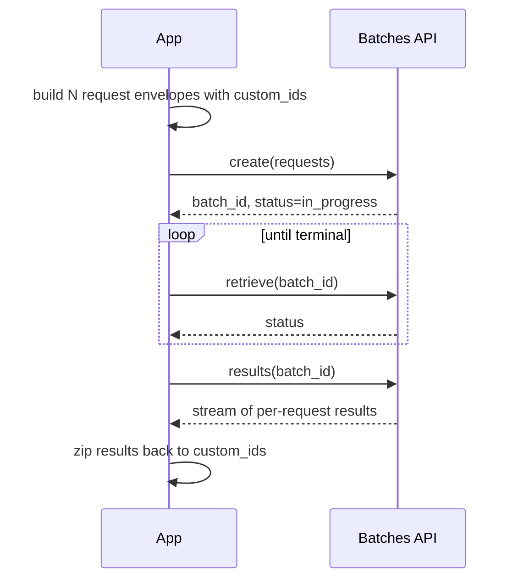

# Recipe 06: Offline evaluation at scale with the Message Batches API

## Problem

You need to run 100 — or 10,000 — prompts through Claude for an evaluation
sweep, a data-labeling pass, or an overnight backfill. Synchronous requests
would be expensive and slow. The Message Batches API delivers the work
asynchronously at roughly half the per-token price within a 24-hour SLO.

## Claude features used

- **Message Batches API**: `client.messages.batches.create`, `.retrieve`,
  `.results`.
- **`custom_id`** for stable request-to-response correlation.
- **Terminal status polling** — `ended`, `failed`, `canceled`, `expired`.

## Pattern



## Implementation

- `build_batch_requests` — `[(custom_id, prompt), ...]` to Batch envelopes.
- `write_batch_jsonl` / `load_batch_jsonl` — persist and reload batch input.
- `submit_batch` — create the batch and return the id; logs a structured
  event.
- `poll_batch` — polls with a configurable interval until a terminal state
  or `max_polls`. A `sleep` hook keeps tests fast.
- `iter_batch_results` — materializes results with `custom_id` preserved.
- `run_batch` — end-to-end orchestration returning a `BatchOutcome`.

## Running it

```bash
python recipes/06-batch-api/recipe.py --count 100
```

The CLI writes `batch_input.jsonl` (generated from the prompt set), submits
the batch, polls until it ends, and prints a summary.

## Expected output

```json
{
  "batch_id": "msgbatch_01HZDMM3V7K8ZB",
  "status": "ended",
  "polls": 5,
  "result_count": 100,
  "first_results": [
    {"custom_id": "eval-0000", "result_type": "succeeded", "text": "neutral"}
  ]
}
```

Full example in [`expected_output.json`](expected_output.json).

## Testing

`test_recipe.py` covers:

1. Envelope shape — `build_batch_requests` produces correct params with
   `system`, `max_tokens`, `messages`.
2. JSONL roundtrip — write then reload returns the exact structure.
3. Submit — returns the id emitted by the SDK.
4. Poll — advances through `in_progress` states and stops at `ended`; also
   times out when the batch never completes.
5. Results — extracts `text` from the first text block of each result.
6. End-to-end — fake batches API drives a full `run_batch` cycle.
7. Shipped fixture — the 100-line `batch_input.jsonl` parses correctly.

## When to use this

- Use for offline evaluations, backfills, and labeling jobs where you can
  wait up to 24 hours for completion.
- Use when you want half-price inference without giving up the full
  Messages API surface (tools, vision, caching — all supported in batch).
- Avoid for interactive or near-real-time paths; synchronous or streaming
  calls are the right tool there.

## Extending

- **Feed the eval framework.** Parse batch results into `EvalCase` /
  `EvalResult` pairs and run the standard rubrics — see recipe 10.
- **Chunked submissions.** For 10K+ prompts, split into multiple batches to
  stay under the 100 MB per-batch payload limit.
- **Failure triage.** `result_type` can be `succeeded`, `errored`, or
  `canceled`. Pipe errored entries to a sync retry queue so a few bad
  prompts don't kill the whole run.

## References

- [Anthropic: Message Batches API](https://docs.anthropic.com/en/docs/build-with-claude/message-batches)
- [Anthropic: Pricing](https://docs.anthropic.com/en/docs/about-claude/pricing)
