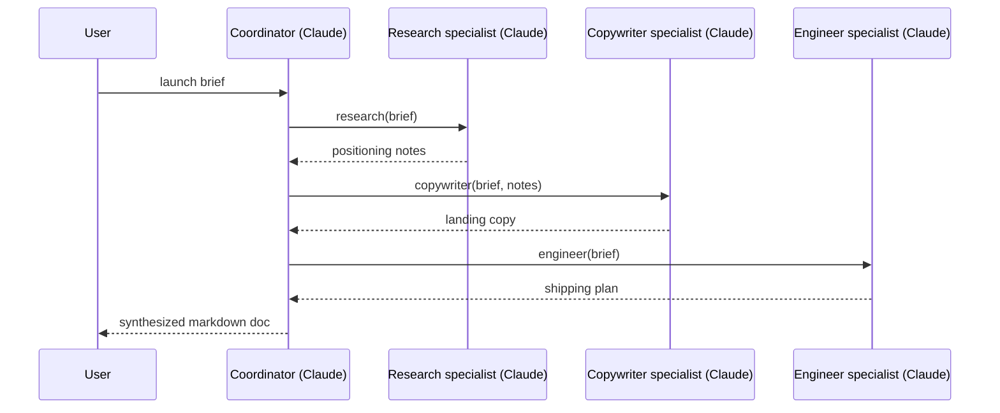

# Recipe 08: Coordinator + specialist multi-agent pattern

## Problem

Drafting a product launch deliverable requires three different kinds of
thinking: research, copy, engineering. A single "do everything" prompt
tends to produce generic output in all three dimensions. Splitting a
coordinator from specialists — each with a tight persona — produces
sharper output with clean seams.

## Claude features used

- **Tool use** as the dispatch mechanism from coordinator to specialists.
- **Multiple independent Claude sessions** driven by the same client — each
  specialist has its own `messages.create` call with its own system prompt.
- **Tool registry** as the abstraction that lets you swap specialist
  implementations without touching the coordinator.

## Pattern



## Implementation

- `make_specialist` — factory that binds a system prompt and a Claude
  client into a callable `str -> str`.
- `build_specialist_tools` — wraps three specialist callables as
  `ToolDefinition` objects with Pydantic v2 schemas. Returns the registry
  and a shared trace list.
- `coordinate` — runs the coordinator tool-use loop until the coordinator
  stops calling tools. Enforces an iteration budget.
- `run_launch` — end-to-end: specialists, registry, coordinator.

## Running it

```bash
python recipes/08-multi-agent/recipe.py --brief "Atlas v2 is ..."
```

## Expected output

Abbreviated — see [`expected_output.json`](expected_output.json):

```json
{
  "iterations": 4,
  "final_document": "## Positioning\n... ## Copy\n... ## Engineering plan\n...",
  "trace": [
    {"specialist": "research"},
    {"specialist": "copywriter"},
    {"specialist": "engineer"}
  ]
}
```

## Testing

`test_recipe.py` covers:

1. `make_specialist` sends the right system prompt to Claude.
2. `build_specialist_tools` registers exactly `research`, `copywriter`,
   `engineer`.
3. Happy-path coordination — coordinator calls all three specialists in
   order and produces the three-section final document.
4. Budget path — coordinator that keeps calling `research` stops cleanly.
5. End-to-end: `run_launch` with specialists that actually call Claude
   results in seven `messages.create` calls (four coordinator rounds + one
   specialist invocation per specialist) and three trace entries.

## When to use this

- Use when sub-tasks have meaningfully different personas or data access.
- Use when you want an auditable trace of which specialist produced which
  section.
- Avoid for small tasks where a single prompt would do — the extra
  coordinator round-trips add latency and cost.
- Avoid when strict consistency across sections matters — different
  specialists may stylistically clash; compensate with a strict final-
  document contract or an additional editor specialist.

## Extending

- **Cheaper specialists.** Route specialists to Haiku while keeping the
  coordinator on Sonnet; override `default_model` per specialist.
- **Parallel specialists.** The current coordinator runs specialists
  sequentially. For independent sub-tasks, the coordinator can emit
  multiple `tool_use` blocks in one assistant turn and you can dispatch
  them concurrently.
- **Editor specialist.** Add a fourth specialist that edits the final
  document for voice and length. Call it as the last step.

## References

- [Anthropic: Tool use](https://docs.anthropic.com/en/docs/build-with-claude/tool-use)
- [Anthropic: Building effective agents](https://www.anthropic.com/research/building-effective-agents)
