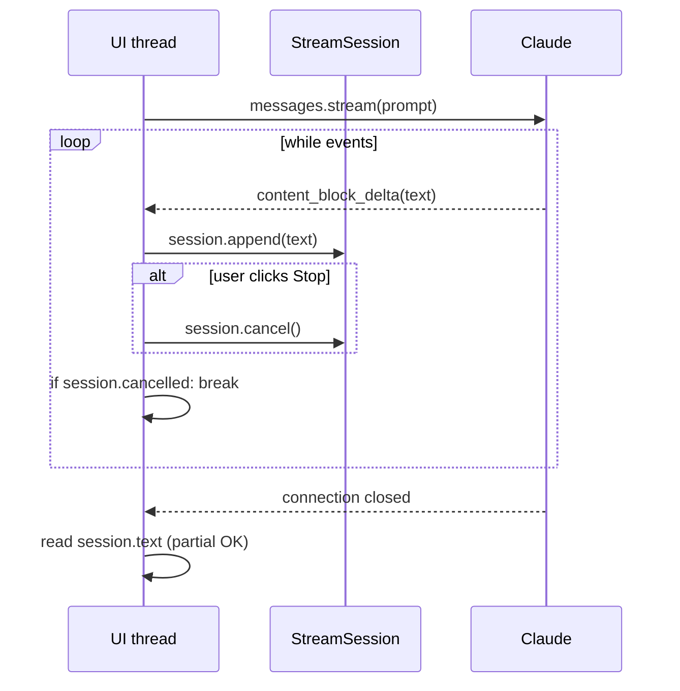

# Recipe 09: Streaming responses with user-triggered cancellation

## Problem

Production chat UIs stream tokens. Users click "Stop" mid-generation. The
server must stop billing, close the upstream connection, and preserve the
partial output for display — not throw it away. Implementing this correctly
is one of the most common production bugs we see.

## Claude features used

- **Streaming API** — `messages.stream()` context manager yielding SDK
  events.
- **`content_block_delta` / `message_delta` / `message_stop` events.**
- **Usage capture in the final message_delta** for cost reconciliation.

## Pattern



## Implementation

- `StreamSession` — mutex-guarded state container: `buffer`, `cancelled`,
  `stop_reason`, `usage`, `cancel_at`. Thread-safe `cancel()` for UI
  threads calling from a button handler.
- `stream_response` — drives the event loop. Accepts an optional
  `event_source` parameter for tests to inject a fake event stream; in
  production it opens the SDK's `messages.stream` context manager.
- `_drive` — the inner loop that checks cancellation before each event and
  updates the session from `content_block_delta`, `message_delta`, and
  `message_stop` events.

## Running it

```bash
# Stream to stdout
python recipes/09-streaming-with-interruption/recipe.py --prompt "Explain prompt caching"

# Stream and auto-cancel after 2 seconds
python recipes/09-streaming-with-interruption/recipe.py \
    --prompt "Explain prompt caching in 500 words" --cancel-after 2
```

## Expected output

After cancellation:

```json
{
  "cancelled": true,
  "stop_reason": "cancelled",
  "text": "Prompt caching lets applications share a stable system-prompt prefix...",
  "usage": {"output_tokens": 47}
}
```

See [`expected_output.json`](expected_output.json).

## Testing

`test_recipe.py` covers:

1. `_text_delta_from_event` extracts text only from
   `content_block_delta.text_delta` events.
2. `stream_response` accumulates every text delta and records the stop
   reason.
3. The `on_text` callback receives every chunk in order.
4. **Cancellation preserves partial text**: text observed before cancel
   survives; text after cancel is dropped.
5. `StreamSession.cancel()` is idempotent and thread-safe.
6. Usage is captured from the `message_delta` event.

No test exercises the real SDK; we inject a synthetic event generator so
the whole file runs offline.

## When to use this

- Use for any user-facing chat UI with tokens rendered incrementally.
- Use when a task can be cancelled mid-generation and partial output is
  still valuable (drafts, summaries).
- Avoid for batch or backend jobs — the regular `messages.create` surface
  is simpler.
- Avoid when you need structured output end-to-end; partial JSON is rarely
  parseable until the stream completes.

## Extending

- **Server-sent events over HTTP.** Wrap `stream_response` in an async
  generator that yields SSE frames for a FastAPI or Starlette endpoint.
- **Token-budget cancel.** Cancel when `session.usage["output_tokens"]`
  exceeds a budget.
- **Reconnect on drop.** Catch network errors inside the inner loop,
  wrap the session with a "resumable" id that your app can present back to
  a second `messages.stream` call with the accumulated history.

## References

- [Anthropic: Streaming](https://docs.anthropic.com/en/api/messages-streaming)
- [Anthropic: Server-sent events format](https://docs.anthropic.com/en/api/messages-streaming)
