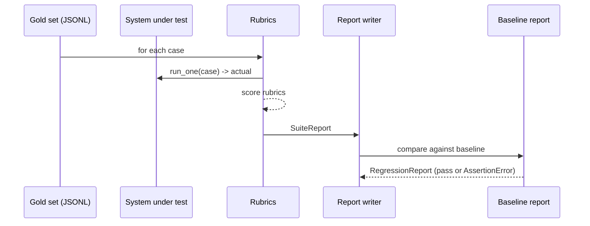

# Recipe 10: Standardized eval framework

## Problem

Every recipe needs a way to answer "did this change make things better or
worse?" A standardized evaluation harness with gold sets, rubric scoring,
and regression detection turns that question into a one-line assertion in
CI. This recipe is the public face of the framework; the implementation
lives in `common/eval.py` and `recipes/10-eval-framework/rubrics.py` so
every other recipe can reuse it.

## Claude features used

- **LLM-as-judge** via `JudgeRubric` — only used for high-bandwidth,
  subjective scoring; the other rubrics are deterministic and free.
- Works across all recipe types: tool use, RAG, vision extraction,
  streaming, batch.

## Pattern



## Implementation

- `common/eval.py`
  - `EvalCase`, `EvalSuite`, `SuiteReport`, `RegressionReport`
  - `Rubric` base class and four built-ins: `KeywordPresenceRubric`,
    `ExactMatchRubric`, `JSONSchemaRubric`, `NumericToleranceRubric`,
    `JudgeRubric`.
  - `run_suite(suite, run_one=...)` — the core driver.
- `recipes/10-eval-framework/rubrics.py`
  - `FaithfulnessRubric`, `GroundednessRubric`, `LabelConfusionRubric`,
    `StructureRubric` — higher-level rubrics for RAG, classification, and
    structured agent output.
- `recipes/10-eval-framework/framework.py`
  - `load_gold_set(path)`, `default_rag_rubrics`, `default_classification_rubrics`,
    `default_structured_output_rubrics`.
  - `evaluate(suite, run_one, baseline_path, report_path)` — the single
    entry point every other recipe uses.

## Running it

```bash
# Run the shipped 20-case example suite against a deterministic fake system
python recipes/10-eval-framework/framework.py
```

## Expected output (shipped sample)

See [`reports/sample_report.md`](reports/sample_report.md) for an example
markdown report with rubric-by-rubric scores and regression verdict.

## Testing

`test_framework.py` covers:

1. The shipped 20-case gold set parses.
2. `FaithfulnessRubric` passes when all citations are retrieved, fails on
   fabrication, fails with no citations.
3. `GroundednessRubric` rewards overlap with `case.metadata.context` and
   skips cleanly when no context is present.
4. `LabelConfusionRubric` is case- and punctuation-insensitive.
5. `StructureRubric` requires every marker to be present.
6. Default rubric bundles return the expected types.
7. `evaluate` writes reports and raises `AssertionError` on regression.
8. `JudgeRubric` correctly parses the judge's first-line score from a
   mocked client.

All tests run without an API key.

## Integrating with a recipe

```python
from pathlib import Path
from recipes_10_eval_framework.framework import evaluate, load_gold_set
from common.eval import EvalSuite
from recipes_10_eval_framework.rubrics import FaithfulnessRubric

def run_rag_case(case):
    result = my_rag_pipeline(case.prompt)
    return result["answer"]

suite = EvalSuite(
    name="rag-smoke",
    cases=load_gold_set(Path("rag_gold.jsonl")),
    rubrics=[FaithfulnessRubric()],
)
report, regression = evaluate(
    suite=suite,
    run_one=run_rag_case,
    baseline_path=Path("rag_baseline.json"),
    report_path=Path("reports/rag_smoke.md"),
)
```

## When to use this

- Use whenever you change a prompt, tool, retriever, or model — run the
  suite before and after.
- Use in CI as a regression gate on a small curated smoke set, and in
  overnight jobs on a larger set via recipe 06 (Batch API).

## Extending

- **Custom rubrics** — subclass `Rubric`, override `evaluate(case, actual)`.
- **Weighted scoring** — set `rubric.weight` and `run_suite` does the
  weighting automatically.
- **Slice reports** — group `SuiteReport.results` by `metadata["topic"]`
  and report per-slice pass rates.

## References

- [Anthropic: Define success criteria](https://docs.anthropic.com/en/docs/test-and-evaluate/define-success)
- [Anthropic: Evaluate prompts](https://docs.anthropic.com/en/docs/test-and-evaluate/develop-tests)
